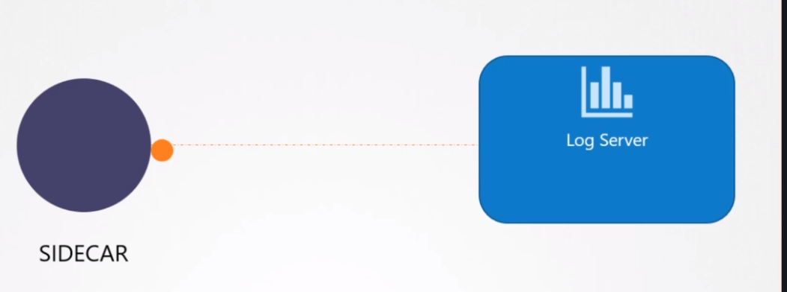
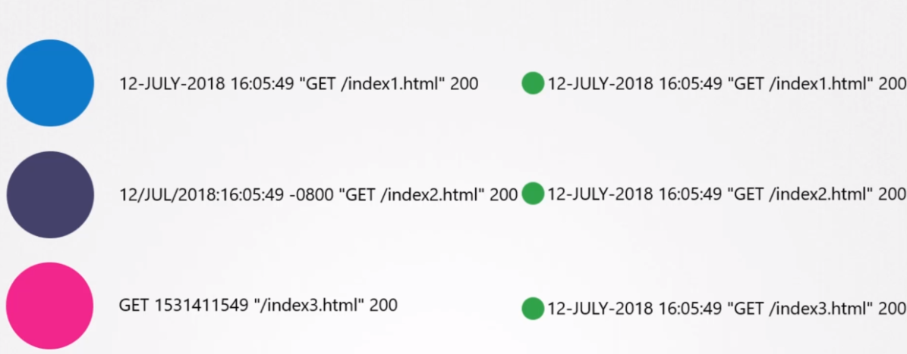

# tl;dr Kubernetes

> **Prerequisites**:
> * Be comfortable with YAML ✍️ 
>   * [YAML in One Video](https://www.youtube.com/watch?time_continue=83&v=cdLNKUoMc6c&feature=emb_title)

## Quick Links
* [Visit the Kubectl Wiki](https://kubernetes.io/docs/reference/generated/kubectl/kubectl-commands)
* [Read the Kubectl Book](https://kubectl.docs.kubernetes.io/)
* [Visit the Minikube Wiki](https://minikube.sigs.k8s.io/docs/)


## Table of Contents
   * [Introduction](#introduction)
   * [Install Kubectl](#install-kubectl)
   * [Install Minikube](#install-minikube)
   * [Minikube Cookbook](#minikube-cookbook)
   * [Concepts](#concepts)
      * [Worker Nodes](#worker-nodes)
      * [Pods](#pods)
      * [Namespaces](#namespaces)
      * [Labels and Selectors](#labels-and-selectors)


----

   
# Introduction
   Welcome to a **No Nonsense** guide to Kubernetes. I promise to do my best to
   introduce material in a logical manner, provide production-centric examples,
   pepper in memes and gifs to keep things feeling fresh, and explain 
   complicated material as simply as possible. If ther securityContext:
      allowPrivilegeEscalation: false


## Install Kubectl

   **[Visit the Kubectl Wiki](https://kubernetes.io/docs/reference/generated/kubectl/kubectl-commands)**

   **[Read the Kubectl Book](https://kubectl.docs.kubernetes.io/)**

   > Kubectl is the command line tool used to run commands against your Kubernetes cluster.

   You must use a kubectl version that is within one minor version difference of
   your cluster. For example, a v1.2 client should work with v1.1, v1.2, and v1.3
   master. Using the latest version of kubectl helps avoid unforeseen issues.


   _[Add Windows or MacOS instructions with a pull request!](https://github.com/strickolas/tldr/pulls)_

   <details open>
   <summary>
   <a class="btnfire small stroke"><em class="fas fa-chevron-circle-down"></em>&nbsp;&nbsp;Installation on Linux</a>    
   </summary>

   1. Install kubectl
      ```bash
      curl -LO https://storage.googleapis.com/kubernetes-release/release/`curl -s https://storage.googleapis.com/kubernetes-release/release/stable.txt`/bin/linux/amd64/kubectl
      ```
      To download a specific version, replace the `$(curl -s
      https://storage.googleapis.com/kubernetes-release/release/stable.txt)` portion of
      the command with the specific version number.

   1. Make the kubectl binary executable and move it into your path
      ```bash
      chmod +x ./kubectl && sudo mv ./kubectl /usr/local/bin/kubectl
      ```

   1. Test your install:
      ```bash
      kubectl version --client
      ```

   </details>

   [Back to top](#quick-links)


----


## Install Minikube

   **[Visit the Minikube Wiki](https://minikube.sigs.k8s.io/docs/)**

   > Minikube is a lightweight Kubernetes implementation that creates a VM on your
   > local machine and deploys a simple cluster containing only one node.


   _[Add Windows or MacOS instructions with a pull request!](https://github.com/strickolas/tldr/pulls)_

   <details open>
   <summary>
   <a class="btnfire small stroke"><em class="fas fa-chevron-circle-down"></em>&nbsp;&nbsp;Installation on Linux</a>   
   </summary> 

   1. Install either [KVM](https://www.linux-kvm.org/page/Main_Page) (which also
      uses QEMU) or [Virtualbox](https://www.virtualbox.org/wiki/Downloads).

      1. If you are a **RHEL/CentOS/Fedora user installing VirtualBox**, you might
         encounter:
         ```
         This system is currently not set up to build kernel modules.
         Please install the gcc make perl packages from your distribution.
         Please install the Linux kernel "header" files matching the current kernel
         for adding new hardware support to the system.
         The distribution packages containing the headers are probably:
            kernel-devel kernel-devel-5.3.7-301.fc31.x86_64

         There were problems setting up VirtualBox.  To re-start the set-up process, run
         /sbin/vboxconfig
         as root.  If your system is using EFI Secure Boot you may need to sign the
         kernel modules (vboxdrv, vboxnetflt, vboxnetadp, vboxpci) before you can load
         them. Please see your Linux system's documentation for more information.
         ```

         This may cause some extra complication, but I've found that the simplest
         solution is to just disable secure boot in your bios.

      1. If you don't want to use a VM, use the `--driver=none` flag to run Kubernetes
         components directly on the host. Using this driver requires
         [Docker](https://www.docker.com/products/docker-desktop) and a Linux
         environment but not a hypervisor. Do not install Docker using snap, as it
         will more than likely be outdated.
         * > **Caution**: The `none` VM driver can result in security and data loss
            issues. Before using --driver=none, consult 
            [this documentation](https://minikube.sigs.k8s.io/docs/drivers/none/) 
            for more information.
            
   1. Now, install Minikube via:
      ```bash
      curl -Lo minikube https://storage.googleapis.com/minikube/releases/latest/minikube-linux-amd64 \
      && chmod +x minikube
      ```

   1. Add minikube to your path:
      ```bash
      sudo install minikube /usr/local/bin/ && rm ./minikube
      ```

   1. Verify install replacing the `driver_name` with the hypervisor of your choice
      from [this list](https://kubernetes.io/docs/setup/learning-environment/minikube/#specifying-the-vm-driver).
      Run the following:
      
      1. ```bash
         minikube start --driver=<driver_name>
         ```

      1. Once `minikube start` finishes, run:
         ```bash
         minikube status
         
         # Your output should look something like this:
         #> host: Running
         #> kubelet: Running
         #> apiserver: Running
         #> kubeconfig: Configured
         ```
         
      1. If something doesn't seem right, use the following to increase your 
         logging level:
         ```bash
         minikube -v=9 start
         ```

      1. When all else fails, you can always blow away your minikube environment using:
         ```bash
         minikube delete
         ``` 
      
      1. Stop minikube with:
         ```bash
         minikube stop
         ```
   </details>

   [Back to top](#quick-links)


---

# The Basics

## Pods

There are **four** top level properties to a Kubernetes config yaml:
1. **apiVersion**: Each apiVersion supports different Kubernetes objects. For
   an exhaustive list, see Kubernetes'
   [docs](https://kubernetes.io/docs/reference/generated/kubernetes-api/v1.11/),
   but don't let it bog you down. See our `/cheatsheets/` file.
1. **kind**: The type of Kubernetes object.
1. **metadata**: Data that describes the K8s objects. 
1. **spec**: The _desired state_ of the K8s object. Kubernetes will work to make
  sure that the current state of the objects matches the desired state; in other
  words, that the **spec** matches the **status** of the object.

```yaml
# 1. Version of K8s API to use.
apiVersion: v1

# 2. Kind of object being created.
kind: Pod

# 3. Describes K8s the object; "name" and "labels" are a few of many valid keys.
metadata:
   name: myapp-pod
   labels:
      app: myapp
      type: front-end
      nonsensical-bologna: boop 
      # You can put any key/value pairs you want in labels.
      # While "app" and "type" seem like they may be important labels, they are
      # something that we will use to organize our objects. 
      
# 4. The desired state of the object which K8s will work to maintain.
spec:
   containers:
      - name: nginx-container
        image: nginx
```

The `kind: Pod` specifies that we are creating a **Pod**, which is a collection
of container(s) that share resources, have a single IP, and can share volumes.
Pods run on worker nodes, and are the smallest unit that Kubernetes can
understand. You will rarely manage pods yourself, and instead, will rely on one
of Kubernetes' control structures to manage them. **Pods run on worker nodes.**

[Back to top](#quick-links)


---


## Labels, Selectors and Annotations

```yaml
apiVersion: v1
kind: Pod
metadata:
   name: simple-webapp

   # 1
   labels:
      app: App1
      function: front-end

   # 2
   annotations:
      buildVersion: 1.2.3
      forAssistance:
         call: "555-555-5555"
         email: "jdoe@corp.com"
         allowsTexts: True
      ownedBy: 
         name: "Alex Yu"
         dept: "Psychotronics"
spec:
   containers:
      - name: nginx
        image: nginx
```

1. `labels` are used to help filter K8s objects in conjunction with a 
   **selector**. Labels are visible to Kubernetes.
   ```yaml
   kubectl get pods --selector app=App1
   # or
   kubectl get pods --selector function=front-end
   ```
1. `annotations`, on the other hand, are used to communicate information with
   other engineers. In our annotations section, we list a person to contact in
   case an engineer needs assistance, and who owns the application. This
   information is not visible to Kubernetes. 

[Back to top](#quick-links)


---


## Replica Sets

A **Replica Set** will make sure that a certain number of objects exist which
match a particular query. A ReplicaSet has 3 very important fields used to
define it's functionality. 
1. **template**: the Pod to be created. Does the data in `template` look 
   familiar? It should! It is copied directly from the above pod definition.
   **NOTE**: We don't specify an `apiVersion` or `kind` in template. This is
   because we always assume we are using `apiVersion: v1`, and `kind: Pod`.
1. **selector**: provides us with a tool to query for pods that we care about.
1. **replicas**: specifies the number of pods we want to exist at a given time.

```yaml
# Remember, every K8s object has apiVersion, kind, metadata, and a spec.
apiVersion: apps/v1
kind: ReplicaSet
metadata:
  name: myapp-repplicaset
  labels:
    app: myapp
    type: front-end
    guess_what: chicken_butt
spec:

  # 1. Provides a template of a pod we wish to create when needed.
  template:
    metadata:
      name: myapp-pod
      labels:
        app: myapp
        type: front-end
        boop: blarp
    spec:
      containers:
        - name: nginx-container
          image: nginx

  # 2. This ReplicaSet will watch for all pods that have metadata.type: front-end
  selector: 
    matchLabels:
      type: front-end

  # 3. Watch for 3 objects matching the above selector. 
  replicas: 3
```

We can control ReplicaSets from the command line using the following commands.
1. We can create a ReplicaSet using our config with:
   ```bash
   kubectl create -f replicaset-def.yaml
   ```

1. We can list existing ReplicaSets using:
   ```bash
   kubectl get replicaset
   ```

1. We can describe a ReplicaSet using:
   ```bash
   kubectl describe replicaset myapp-replicaset
   ```

1. We can update a ReplicaSet using:
   ```bash
   kubectl replace -f replicaset-def.yaml
   ```

1. We can delete a ReplicaSet using:
   ```bash
   kubectl delete replicaset myapp-replicaset
   ```
   **BEWARE!** Deleting a ReplicaSet also deletes all underlying pods.

Let's say we end up needing more replicas than we currently have. We can scale
our ReplicaSet in one of 3 ways.

1. This is the preferred way if you want to update the yaml file. Simple change
   the number of replicas in the config from 3 to 6... or however many you want.
   ```bash
   kubectl replace -f replicaset-def.yaml
   ```

1. This is the preferred way if you don't want to change the yaml file, but
   want to make changes to the deployed object.
   ```bash
   kubectl scale --replicas=6 -f replicaset-def.yaml
   ```

1. This is the preferred way if you don't want to specify the file. Note that
   this requires the object type, followed by the object name.
   ```bash
   kubectl scale --replicas=6 replicaset myapp-replicaset
   ```

> **Pro Tip**: You can use `replicaset`, `rs`, and `replicasets` 
  interchangeably in the command line.

> **NOTE**: You may see **ReplicationController** being used, which is a K8s object that is
currently being phased out. The only difference is, a ReplicaSet has a selector
which gives the ability to manage pods that have been created before the
ReplicaSet was.

[Back to top](#quick-links)


---


## Deployments

ReplicaSets solve the problem of having enough Pods running to provide high
availability of our application; but it doesn't make it particularly easy to
upgrade over time. This is where **Deployments** come in. Deployments will
make sure that upgrades happen gradually (also known as a rolling upgrade).
Upgrading Pods gradually helps to ensure that users do not notice any downtime.
Deployments also make it easy to rollback to a previous version of software
if need be. The config for a Deployment is nearly identical to a ReplicaSet's
config, except we update the `kind` to `Deployment`.

```yaml
# Remember, every K8s object has apiVersion, kind, metadata, and a spec.
apiVersion: apps/v1

# 1. This config is nearly identical to ReplicaSet, except for the kind.
kind: Deployment
metadata:
  name: myapp-deployment
  labels:
    app: myapp
    type: front-end
    super: mario
spec:
  template:
    metadata:
      name: myapp-pod
      labels:
        app: myapp
        type: front-end
        boop: blarp
    spec:
      containers:
        - name: nginx-container
          image: nginx
  selector: 
    matchLabels:
      type: front-end
  replicas: 3
  ```

1. We can create our Deployment with:
   ```bash
   kubectl create -f deployment-def.yaml
   ```

1. The Deployment automatically creates a ReplicaSet:
   ```bash
   kubectl get replicaset
   #> NAME                       DESIRED    CURRENT    READY    AGE
   #> myapp-deployment-abc123    3          3          3        2m
   ```

1. The ReplicaSet created by the Deployment will subsequently create Pods:
   ```bash
   kubectl get pods
   #> NAME                             READY STATUS   RESTARTS  AGE
   #> myapp-deployment-abc123-xyz001   1/1   Running  0         2m
   #> myapp-deployment-abc123-xyz002   1/1   Running  0         2m
   #> myapp-deployment-abc123-xyz003   1/1   Running  0         2m
   ```

1. Now that we seem to be working with a bunch of different K8s objects, we can
   utilize the following to make our lives a bit easier.
   ```bash
   kubectl get all
   ```

1. You can format the output from `kubectl` using one of the following:
   * `-o json`: Output a JSON formatted API object.
   * `-o name`: Print only the resource name and nothing else.
   * `-o wide`: Output in the plain-text format with any additional information.
   * `-o yaml`: Output a YAML formatted API object.`

Youtube: How Kubernetes deployments work by Microsoft Azure
[](https://www.youtube.com/watch?v=mNK14yXIZF4 "Youtube: How Kubernetes deployments work by Microsoft Azure")

> **Pro Tip**: You can use the flag `--dry-run` when executing a `kubectl`
  command and it will inform you whether the syntax of the command and config
  are correct, as well as if the resource is able to be created.

[Back to top](#quick-links)


---


## Namespaces

**Namespaces** are a way to organize K8s objects while enforcing policy,
increasing security, and preventing accidental manipulation of vital objects.
Kubernetes creates 3 namespaces when the cluster is created:
1. **Default** - this is where all Kubernetes objects are placed by default
1. **kube-system** - where K8s places all Pods and Services used by K8s to run,
   such as those required by the networking solution, the DNS service, etc.
1. **kube-public** - where K8s objects that should be available to all users
   are placed.

You can create your own Namespaces, for example, a namespace for `prod`
and another for `dev`. This way, while working in the development
environment, you don't accidentally interact with a K8s object that belongs
to the production namespace.

We can access K8s objects outside of the current namespace by referencing its 
fully qualified domain name as configured by Kubernetes. For example:
```python
# Access a service from within the namespace.
mysql.connect("db-service")                       

# Access a service from outside of namespace using that resource's full name.
mysql.connect("db-service.dev.svc.cluster.local")
# Object named db-service,
#      from the namespace dev,
#        a K8s object of type svc 
#             with the domain name cluster.local


# Playing with mnemonics to remember this for the CKAD exam:
# name.space.type.domain
# Nina Simone is a Taurus from Detroit
```

You can run any `kubectl` command against a namespace of your chosing by
specifying the namespace:
```bash
kubectl create -f pod-def.yaml --namespace=dev
```

We can also declare the namespace that a Kubernetes object should be placed in
via a metadata tag:
```yaml
apiVersion: v1
kind: Pod

metadata:
   name: myapp-pod
   namespace: dev
   labels:
      app: myapp
      type: front-end
      asdf: abc123
spec:
   containers:
      -name: nginx-container
       image: nginx
```

We can define a custom Namespace in one of two ways:

1. Via yaml 
   ```yaml
   apiVersion: v1
   kind: Namespace
   metadata:
      name: dev
   ```
   followed by the command to `kubectl`:
   ```
   kubectl create -f namespace-dev.yaml
   ```

2. ```
   kubectl create namespace dev
   ```

> **Pro Tip**: You can permanently change your default namespace with the following
 `kubectl config set-context $kubectl config current-context) --namespace=dev`

> **Pro Tip**: We can list all Pods, Deployments, ReplicaSets, etc, across all
  Namespaces via `kubectl get pods --all-namespaces`

[Back to top](#quick-links)


---


# Mastering Config-Fu


## Commands and Arguents
Let's say we have a Dockerfile that looks like this:
```Dockerfile
FROM Ubuntu

# the command that is run at startup. 
ENTRYPOINT ["sleep"]

# the arguments passed to the above command. 
CMD ["5"]
```

What if we wanted to change this behavior when we spin up the container in a
Pod? This is where the following come in:

1. **command**: overrides the ENTRYPOINT of the Dockerfile we are creating in a
   Pod.

1. **args**: overrides the CMD of the Dockerfile we are creating in a Pod.
```yaml
apiVersion: v1
kind: Pod
metadata: 
   name: my-ubuntu-pod
spec:
   containers:
      - name: my-ubuntu-container
        image: my-ubuntu-container
        command: ["sleep"]
        args: ["10"]
```

[Back to top](#quick-links)


---


## Environment Variables, ConfigMaps, and Secrets

We can pass **environment variables** into our container as key-value pairs
like so:
```yaml
apiVersion: v1
kind: Pod
metadata:
   name: simple-webapp-color
spec:
   containers:
      - name: simple-webapp-color
        image: simple-webapp-color

        # We pass environment values 
        env:
           - name: APP_COLOR
             value: pink
           - name: DO_NOT_DELETE
             value: /usr/bin
```

A **ConfigMap** is an abstraction that makes it easy to manage a lot of
environment variables at once. When we create a ConfigMap below, take note of
the fact that there is no `spec` key, but instead, a `data` key.
```yaml
apiVersion: v1
kind: ConfigMap
metadata: 
  name: app-config 
data: 
  APP_COLOR: blue
  APP_MODE: prod
  MY_NUMBER: 3.14
  FAV_PATH: "/usr/local/bin"
```

You can use the following with the `kubectl` tool:
```yaml
kubectl create -f configmap-def.yaml
kubectl get configmaps 
```

We can import the `data` from our ConfigMap like so:
```yaml
apiVersion: v1
kind: Pod
metadata:
   name: simple-webapp-color
   labels:
      name: simple-webapp-color
spec:
   containers:
      - name: simple-webapp-color
        image: simple-webapp-color
        
        # Use an existing ConfigMap named app-config
        envFrom:
           - configMapRef:
                name: app-config 
```

**Secrets** are very similar to a ConfigMap, except they are stored in an
encoded format. The values of `data.YOUR_KEY` must be encoded into base 64. To
learn how to do this, see the comments in the config below.
```yaml
apiVersion: v1
kind: Secret
metadata:
   name: app-secret
data:
   DB_Host: bXlzcWw=         # echo -n 'mysql' | base64
   DB_User: cm9vdA==         # echo -n 'root' | base64
   DB_Pass: cGFzc3dvcmQxMjM= # echo -n 'password123' | base64
```

You can decode a base64 string like so:
```bash
echo -n 'bXlzcWw=' | base64 --decode
```

We can view secrets in our cluster using:
```
kubectl get secrets
```

Now, let's give a container access to our Secret.
```yaml
apiVersion v1:
kind: Pod
metadata:
   name: simple-webapp-color
   labels:
      name:simple-webapp-color
spec:
   containers:
      -  name: simple-webapp-color
         image: simple-webapp-color

   # Name of the K8s object goes here.
   envFrom:
      - secretRef:
           name: app-secret
```

> **For production**: You may have noticed that base64 isn't actually doing
anything to keep our information safe, since it can be very easily decoded. 
Have a look at 
[this article](https://blog.aquasec.com/managing-kubernetes-secrets) 
to learn more about the shortcomings of Secrets, as well as how to use secrets
in a production environment. (tl;dr use
[AWS Secrets Manager](https://aws.amazon.com/secrets-manager/),
[Google Cloud Key Management Service](https://cloud.google.com/kms/), or
[Azure Key Vault](https://azure.microsoft.com/en-in/services/key-vault/)).

[Back to top](#quick-links)


---


## Security Contexts
Docker implements a set of security features which limits the abilities of the 
container's root user. This means that, by default, the root user within a 
container has a lot of Linux capabilities disabled, such as `CHOWN`, `DAC`,
`KILL`, `SETFCAP`, `SETPCAP`, `SETGID`, `SETUID`, `NETBIND`, `NET_RAW`,
`MAC_ADMIN`, `BROADCAST`, `NET_ADMIN`, `SYS_ADMIN`, and `SYS_CHROOT` to name a 
few. To view a full list of linux capabilities, run the following:
```bash
cat /usr/include/linux/capability.h
```

If you want to make changes to the capabilities a Docker container has, you can 
run one of the following:
```bash
docker run --cap-add MAC_ADMIN ubuntu  # adds a capability to a container
docker run --cap-drop KILL ubuntu      # removes a capability from a container
docker run --privileged ubuntu         # adds all capabilities to a container.
```
In Kubernetes, defining a set of enabled and disabled Linux capabilities is
called a **Security Context**. We can apply a security contexts like so:
``` yaml
apiVersion: v1
kind: Pod
metadata:
   name: mypod
spec:

   # 1
   securityContext:
      runAsUser: 1000
      runAsGroup: 3000
      fsGroup: 2000
      capabilities:
         add: ["MAC_ADMIN"]

   containers:
      - name: ubuntu
        image: ubuntu
        command: ["sleep", "3600"]
        
        # 2
        securityContext:
            capabilities:
                add: ["NET_ADMIN"]


      - name: some-other-thing 
        image: some-other-thing
        command: ["sleep", "3600"]

        # 3
        securityContext:
            allowPrivilegeEscalation: false
```
Take note of the following:
1. We are applying the following to all containers in the pod.
   * **runAsUser**: specifies that for any containers in the Pod, all processes
     will run with user ID 1000.
   * **runAsGroup**: specifies the primary group ID of 3000 for all processes
     within any containers of the Pod. If this field is omitted, the primary
     group ID of the containers will be root(0).
   * **fsGroup**: specifies a supplementary group that the containers belong 
     to. In this case, containers in this Pod belong to supplementary group ID
     2000.
   
2. We are applying the `NET_ADMIN` capability only to the `ubuntu` container.

3. We are disabling privilege escalation only to the `some-other-thing` 
   container.

As you might imagine, there's actually quite a lot to security contexts, which
you can read more about 
[here](https://kubernetes.io/docs/tasks/configure-pod-container/security-context/#set-the-security-context-for-a-container),
but this should do for a tl;dr article for now.

[Back to top](#quick-links)


---


## Service Accounts
Authentication, Authorization, RBAC, etc...
There are two types of accounts in K8s. A **user account** is used by admins,
developers and... well... users! A **ServiceAccount** is used by machine; such
as a system monitoring tool like Prometheus, or a build automation tool like 
Jenkins. Let's create a service account:

```bash
kubectl create serviceaccount my-serviceacct
```

Let's list the service accounts that exist within our NameSpace.

```bash
kubectl get serviceaccounts
#> NAME            SECRETS     AGE
#> default         1           10d
#> my-serviceacct  1           15s
```

Notice that there are two ServiceAccounts when we run the above command. Some
things to be aware of:
 * For every NameSpace in Kubernetes, a ServiceAccount named `default` is
   automatically created.
 * Each NameSpace has its own default ServiceAccount.
 * Whenever a Pod is created, the default ServiceAccount, and its token,
   are automagically mounted to that Pod as a VolumeMount. If you were to run
   ```bash
   kubectl describe pod some-application
   #> Name:
   #> Namespace:
   #> ... 
   #> Mounts:
   #>   /var/run/secrets/kubernetes.io/serviceaccount from default-token-abc123
   ```
   The `default` ServiceAccount is very limited, and only has permission to run
   basic K8s API queries.

This is because **whenever a new NameSpace is created, an accompanying `default`
service account is created. Each namespace has its own default ServiceAccount.**
Now, let's get the details of the ServiceAccount that we just created:

```bash
kubectl describe serviceaccount my-serviceacct
#> Name:                 my-serviceacct
#> Namespace:            default
#> Labels:               <none>
#> Annotations:          <none>
#> Image pull secrets:   <none>
#> Mountable secrets:    my-serviceacct-token-kbbdm
#> Tokens:               my-serviceacct-token-kbbdm
#> Events:               <none>
```

Notice there is a `Tokens` field with a single element by the name
`my-serviceacct-token-kbbdm`. This object is a Secret, which contains an API
token which will be used to authenticate applications wishing to utilize the
service account. We can get the API Token of `my-serviceacct-token-kbbdm` by
running the following command:
```bash
kubectl describe secret my-serviceacct-token-kbbdm
#> Name:          my-serviceacct-token-kbbdm
#> Namespace:     default
#> Labels:        <none>

#> Type:          kubernetes.io/service-account-token

#> Data
#> ====
#> ca.crt:        1025 bytes
#> namespace:     7 bytes
#> token:
#> jkhfdisuHfiweurfhEKfjheifuHWEFiuwehtjHEfKJHEFKLJhefKJefheL
#> AD1dY0UKn0wThAtThIsT0K3nIsT0ta11ymad3UPl0Lk33puRT0K3NzSaF3
#> DSAf98540fwoeifhjOEfowiej54o3iojFoiJ
```

We can attach this token as an authentication header to `curl`, or put this
token into a 3rd party application that interacts with our K8s cluster.
As said in one of the bullets above, whenever a Pod is created, the `default`
ServiceAccount is mounted as a Volume. We can change the ServiceAccount that 
gets mounted to a Pod like so:
```yaml
apiVersion: v1
kind: Pod
metadata:
   name: my-app
spec:
   containers:
      - name: my-app
        image: my-app

   # You can select one of the following two lines. They are mutually exclusive.
   serviceAccount: my-serviceacct
   automountServiceAccountToken: false
```
**NOTE**: You cannot change the ServiceAccount being used by an existing Pod,
however, you can update the ServiceAccount used by `containers` of Deployment
objects, thanks to rolling upgrade of the Pods associated with the Deployment.


[Back to top](#quick-links)


--- 


## Resource Requests & Limits 

Worker nodes have a limited pool of resources (CPU, memory and disk), so the
K8s scheduler schedules Pods in such a way to avoid starvation. We can include
a **resource request** in a container spec, so that when the scheduler tries to 
place a Pod on a node, it can determine what nodes can support the Pod. If none
of the nodes have enough resources to run the Pod, the Pod will maintain a
status of `Pending`.

If you know that your Pod will need more than the defaults, you can modify
these values. Since Docker containers have no limit to the amount of 
resources they consume on a node, we can impose **limits** on the container.
```yaml
apiVersion: v1
kind: Pod
metadata:
   name: myapp
   labels:
      name: myapp
spec:
   containers:
     - name: myapp
       image: myapp

       resources:
          # 1
          requests:
             memory: "1Gi"
             cpu: 1
            
          # 2
          limits:
             memory: "2Gi"
             cpu: 2
```
1. We request 1 Gibibyte (1024 bytes, as opposed to a Gigabyte, which is 1000
   bytes) and 1 vCPU cores (equivalent to 1 AWS vCPU, 1 GCP Core, 1 Azure Core,
   or 1 Hyperthread).

2. We restrict the container to 2 Gibibytes of memory and 2 vCPU cores. 
   * If a container attempts to consume more vCPU, Kubernetes throttles the vCPU.
   * Containers are allowed to consume more memory than the limit, but if they
     make a habit of overconsuming memory, the Pod will be terminated and
     restarted.


We can declare a **LimitRange** within a Namespace to create default
`resources.requests` and `resources.limits` for all Pods created within that
Namespace. For example:
```yaml
apiVersion: v1
kind: LimitRange
metadata:
   name: mem-limit-range
   namespace: dev
spec:
   limits:

    # 1
    - type: Container
    
    # 2
      defaultRequest:
         memory: 256Mi

    # 3
     default:
         memory: 512Mi
```
The above yaml reads as follows:
1. If a Container is created in the `dev` namespace without specifying its
   own request or limits;
1. then default memory request is created for that Container of 256 Mibibytes;
1. and a memory limit of 512 Mibibytes.


[Back to top](#quick-links)


--- 


## Taints and Tolerations

**Taints** and **tolerations** provides you finer control over where the K8s
scheduler places Pods. A taint is applied to a Node and essentially acts like
"Pod repellent," while tolerations are applied to Pods and act like "taint
immunity." The gif (pronounced `/ɡɪf/`) below should offer some insight.


Above, you can see we have Node_1, Node_2, and Node_3. We also have 4 Pods we 
wish to schedue across the three nodes, Pod_A, Pod_B, Pod_C, and Pod_D. We have
applied a taint on Node_1, and a tolerance on Pod_D. Pod_A, Pod_B, and Pod_C 
are intolerant to the taint on Node_1, so they get scheduled across Node_2 and 
Node_3. Finally, Pod_D is tolerant to the taint on Node_1, so Pod_D gets 
scheduled on Node_1.

To apply a toleration to a Pod, you can add this information to a Pod config:
```yaml
apiVersion: v1
kind: Pod
metadata:
   name: myapp
spec:
   containers:
      - name: my-ubuntu
        image: my-ubuntu
   
   tolerations:
   - key: "app"
     operator: "Equal"
     value: "blue"
     effect: "NoSchedule"
```
See the 
[K8s docs](https://kubernetes.io/docs/concepts/scheduling-eviction/taint-and-toleration/#concepts)
for more yaml variants.

We can apply a taint to a node through the command line like so:
```bash
kubectl taint nodes <node-name> <key>=<value>:<taint-effect>
```
* `node-name` should be replaced with the name of the node you want to apply
  taint to.
* `key`, `value` should be replaced with tolerations that ignore the taint. For
  example, if we only wanted to apply Pods like above to be scheduled on the
  node, we would specify `app=blue`. 
* `taint-effect` defines what would happen to the Pod if they do not tolerate
  the taint. Replace with one of the following to apply an effect:
  1. `NoSchedule`: the Pods will not be scheduled on the Node
  1. `PreferNoSchedule`: K8s will try to avoid placing a Pod on the Node, but 
     this is not guaranteed.
  1. `NoExecute`: new Pods will not be scheduled on the Node, and existing Pods
     on the node, if any, will be evicted if they do not tolerate the taint 
     (these Pods may have been scheduled on the Node before the taint was 
     applied).

> **Fun Fact**: A Kubernetes cluster is composed of a single Master Node, and 
  _n_-many Worker Nodes. By default, no Pods can be scheduled on the Master
  Node, which is accomplished via a Taint. You can modify this behavior if you
  need (which I don't recommend), but you can view this taint via
  `kubectl describe node kubemaster | grep Taint`.

[Back to top](#quick-links)


---


## Node Selectors and Affinity

We can assign a label to a Node from the command line like so:

```bash
kubectl label nodes <node-name> <label-key>=<label-value>
```

* `node-name` should be replaced with the name of the node you want to attach
  the label to.
* `label-key` is the key you want to assign to the node.
* `label-value` is a value you want to assign to the node.

Let's say we have a single Node in our cluster that is a lot beefier than the
rest, and we want to prefer that a particular Pod runs on it to avoid sucking
up too many resources of the weaker nodes. We can apply a label on it like so:
```bash
kubectl label nodes my-big-node size=Large
```

Now, we can control where Pods are scheduled in another way, through the use of
a **nodeSelector**. 
```yaml
apiVersion: v1
kind: Pod
metadata:
   name: myapp-pod
spec:
   containers:
      - name: data-processor
        image: data-processor
   
   # 1
   nodeSelector:
      size: Large
```
1. The `nodeSelector` is scheduling this Pod on Nodes with the label 
   `size=Large`. This pod will get scheduled on `my-big-node` due to the
   kubectl command we ran above.


There are limitations to nodeSelectors. For example, we can't specify a Pod to
run on either a Large **OR** Medium Node. Likewise, we can't specify a Pod to 
run on any Node that **IS NOT** Small. This is where **nodeAffinity** comes 
into play.
```yaml
apiVersion: v1
kind: Pod
metadata:
   name: myapp-pod
spec:
   containers:
      - name: data-processor
        image: data-processor
   
   # 1 
   affinity:
      # 2 
      nodeAffinity:
         # 3
         requiredDuringSchedulingIgnoredDuringExecution:
            # 4
            nodeSelectorTerms:
               # 5 
               - matchExpressions:
                  - key: size
                    operator: In
                    values:
                       - Large 
``` 
This yaml file looks super complicated, but it provides the same functionality
as the yaml in the nodeSelector example above. Let's break this down:

1. Define an `affinity` section at the same level as `containers`.

1. Declare that we are going to be applying a `nodeAffinity`.

1. What if there are no Nodes that this could be scheduled to? What if someone
   changes the labels on the Node later on? This is handled via the type of
   nodeAffinity. There are a few types of nodeAffinity that can be used:

   * `requiredDuringSchedulingIgnoredDuringExecution`: the scheduler can only
     place the Pod on matching Nodes, and if no matching Nodes exist, the Pod
     will not be scheduled (thus, **required during scheduling**). If the label
     associated with the Node changes such that the nodeAffinity is no longer
     satisfied, the Pods will continue to run normally (thus 
     **ignored during execusion**).

   * `preferredDuringSchedulingIgnoredDuringExecution`: the scheduler will try
     to place the Pod on matching Nodes, and if no matching Nodes exists, the
     Pod will be scheduled on whatever Node can support it (thus 
     **preferred during scheduling**). If the label associated with the Node
     changes such that the nodeAffinity is no longer satisfied, the Pods will 
     continue to run normally (thus **ignored during execusion**).

   * `requiredDuringSchedulingRequiredDuringExecution`: the scheduler can only
     place the Pod on matching Nodes, and if no matching Nodes exist, the Pod
     will not be scheduled (thus, **required during scheduling**). If the label
     associated with the Node changes such that the nodeAffinity is no longer 
     satisfied, t      _blue-pod.yaml_
      ```yaml
      apiVersion: v1
      kind: Pod
      metadata:
         name: green-pod
      spec:
         containers:
            - name: my-blue-app
              image: my-blue-app
         
         tolerations:
         - key: "app"
           operator: "Equal"
           value: "blue"
           effect: "NoSchedule"
      ```he Pod will be evicted and attempted to be rescheduled.

1. `matchExpressions` are the labels we want to match on. Because we can match
    against multiple values, `values` is a list.

We can accomplish scheduling on a Large **OR** Medium Node by replacing section
5 with:
```yaml
- matchExpressions:
   key: size
   operator: In
   values:
      - Large
      - Medium
```

We can accomplish scheduling on any Node that is **NOT** Small by replacing
section 5 with:
```yaml
- matchExpressions:
  key: size
  operator: NotIn
  values:
     - Small
```

We can choose to only schedule Pods on Nodes which have a particular key by
replacing section 5 with:
```yaml
- matchExpressions:
   key: size
   operator: In
```

[Back to top](#quick-links)


---


## Node Affinity + Taints & Tolerations = An OCD Daydream

Using Node Affinity, Taints, and Tolerations, we have finer control over where
Pods get scheduled. Refer to the gif below:


There's a lot going on here, so let's break it down:
* We have 5 Pods we want to schedule across 5 Nodes. 
* Three of the Pods and Nodes have metadata assigned to them which associates a color to them.
* We don't care where the uncolored Pods get scheduled.
* We don't care what gets schedule on the uncolored Nodes.
* **We want to make sure that exactly one Pod gets scheduled per Node.**
* Now let's take some action to schedule things nicely:
   1. We apply taints to the colored Nodes which looks something like this:
      ```bash
      kubectl taint nodes Blue-Node color=blue:NoSchedule
      kubectl taint nodes Red-Node color=red:NoSchedule
      kubectl taint nodes Green-Node color=green:NoSchedule
      ```
   1. Next, we apply tolerations to the colored Pods, which looks like:

      _green-pod.yaml_
      ```yaml
      apiVersion: v1
      kind: Pod
      metadata:
         name: green-pod
      spec:
         containers:
            - name: my-green-app
              image: my-green-app
         
         tolerations:
         - key: "color"
           operator: "Equal"
           value: "green"
           effect: "NoSchedule"
      ```

      _blue-pod.yaml_
      ```yaml
      apiVersion: v1
      kind: Pod
      metadata:
         name: green-pod
      spec:
         containers:
            - name: my-blue-app
             image: my-blue-app
         
         tolerations:
         - key: "color"
           operator: "Equal"
           value: "blue"
           effect: "NoSchedule"
      ```

      _red-pod.yaml_
      ```yaml
      apiVersion: v1
      kind: Pod
      metadata:
         name: green-pod
      spec:
         containers:
            - name: my-red-app
              image: my-red-app
         
         tolerations:
         - key: "color"
           operator: "Equal"
           value: "red"
           effect: "NoSchedule"
      ```

   1. Then, we attach labels to the colored Nodes for use with NodeAffinity:
      ```bash
      kubectl label nodes Blue-Node node-color=blue
      kubectl label nodes Red-Node node-color=red
      kubectl label nodes Green-Node node-color=green
      ```
   1. Finally, we add Node Affinities to the spec of the colored Pods like so:
      
      _green-pod.yaml_
      ```yaml
      ...
         affinity:
            nodeAffinity:
               requiredDuringSchedulingIgnoredDuringExecution:
                  nodeSelectorTerms:
                     - matchExpressions:
                        - key: color 
                          operator: In
                          values:
                             - green
      ```

      _blue-pod.yaml_
      ```yaml
      ...
         affinity:
            nodeAffinity:
               requiredDuringSchedulingIgnoredDuringExecution:
                  nodeSelectorTerms:
                     - matchExpressions:
                        - key: color 
                          operator: In
                          values:
                             - blue
      ```

      _red-pod.yaml_
      ```yaml
      ...
         affinity:
            nodeAffinity:
               requiredDuringSchedulingIgnoredDuringExecution:
                  nodeSelectorTerms:
                     - matchExpressions:
                        - key: color 
                          operator: In
                          values:
                             - red
      ```

   1. What results is a way to guarantee:
      * the green Pod is scheduled on the green Node.
      * the blue Pod is scheduled on the blue Node.
      * the red Pod is scheduled on the red Node.
      * the two uncolored Pods are not scheduled on any of the colored Nodes,
        but instead, are scheduled arbitrarily across the "Other" Nodes.

[Back to top](#quick-links)


---


# Multi-Container Pods


## Multi-Container Pod Design Patterns
So far, we have been working with a singleton Pods which encapsulate a single
container. Now, we will be working with Multi-Container Pods, which is
something you are more likely to encounter in the wild.

There are three common Multi-Container Pod patterns we will be discussing:

1. **The Sidecar Pattern**: deploying a container alongside the application
   to handle some minor task. For example, we may deploy a log-agent alongside
   a web server to collect logs and forward them to a central log server.


   What if we have a central logging server, and a bunch of different
   applications logging to a central logging server using different logging
   formats? This is where the next pattern comes in...


1. **The Adapter Pattern**: deploy an additional container to allow services
   to cooperate that otherwise wouldn't be able to. This allows you to simply
   deploy a different sidecar container to _adapt_ to new situations as they 
   arise (e.g. change of backend). 

   For example, you may have three applications with logging agents that
   generate logs in completely different formats. An adapter container is
   deployed alongside those logging-agents to normalize the log data before
   sending it off to the central logging server.

   

1. **The Ambassador Pattern**: an "ambassador container" is deployed, which
   essentially acts like a proxy that allows other containers to connect
   to a port on localhost while the ambassador container proxies the connection
   to the appropriate server. For example, say you have different logging 
   servers for development, testing, and production deployments. Using an
   ambassador, we can send all of our logging data to a given port over
   localhost, which wouldn't require changing the source code of the 
   application.

   
  

[Back to top](#quick-links)


---


# Observability


## Status and Conditions

Every Pod has a **status**, which describes the state of the Pod. Pods enter
the following states in this exact order:
   1. `Pending`: When a Pod is first created, it is in a Pending state. This is
      when the scheduler tries to find a Node to place the Pod. If the scheduler
      can't find a Node to place the Pod on, it will be stuck in a Pending state.
      To figure out why the Pod is stuck in Pending, run 
      `kubectl describe pod <name-of-your-pod>`

   1. `ContainerCreating`: Once the Pod is scheduled, it enters the 
      ContainerCreating state, where the necessary images are pulled
      and containers are started.

   1. `Running`: Once all of the containers in a Pod are running, the Pod enters
      the Running state, which it continues to be until the program completes
      successfully, or is terminated.

**Conditions** compliment Pod status. They are an array of true or false values
that tell us about the state of a Pod. You can view the conditions of a Pod by
running `kubectl describe pod`. The (truncated) output will look something like
this:
```bash
Name:          nginx-abc123-asdf
Namespace:     default
Node:          kubenode2/192.168.1.103
Start Time:    Mon, 18 May, 2020 19:20:39 - 0400
Labels:        app=prod
               color=blue

...

Conditions:
   Type:         Status
   Initialized:  True
   Ready:        True
   PodScheduled: True
```

[Back to top](#quick-links)


---


## Readiness Probes

Here's a dangerous little scenario that can easily happen to anybody new to 
K8s. If we were to run `kubectl get pods`, we may get something like this:
```
NAME                  READY      STATUS       RESTARTS   AGE
nginx-abc123-asdf     1/1        Running      0          12m 
```
but when navigate to a web page being served by our Pod, we are greeted with 
this in our browser:


Why does this happen? According to `kubectl get pods`, our Pod is ready, and
its status is Running... What gives? Well, this is caused by erroneously
communicating the readiness of an application. Something like Nginx may take a 
couple of minutes to become accessible. Even though our Nginx Pod **is** 
Running, it is **not truly ready**.

To determine when a Pod is actually ready, we employ **Readiness Probes**
inside the container. As a developer of the appliation, you know what makes the
application _ready_. There are three types of Readiness Probes:

1. **HTTP Readiness Probe**: Checks if a specific path is resolvable.
   ```yaml
   ...
   spec:
      readinessProbe:
         httpGet:
            path: /api/ready
            port: 8080
   ```
   This checks if localhost:8080/api/ready is resolvable.

1. **TCP Test**: Checks if a particular TCP socket is listening.
   ```yaml
   ...
   spec: 
      readinessProbe:
         tcpSocket:
            port: 3306
   ```
   This checks to see if localhost:3306 is listening.

1. **Exec Test**: Execute a custom script within the container that exits with
    an exit code of 0.
   ```yaml
   ...
   spec:
      readinessProbe:
         exec:
            command:
            - cat
            - /app/is_ready.txt
   ```
   This checks to see if /app/is_ready.txt exists, and if it does, cat exits with 0.

There are some additional options we can add to our Readiness Probe.
```yaml
...
spec:
   readinessProbe:
      tcpSocket:
         port:3306

   # 1
   initialDelaySeconds: 10

   # 2
   periodSeconds: 5

   # 3
   failureThreshold: 8
```

1. `initialDelaySeconds`: describes how long to wait before running a Readiness
   Probe.

1. `periodSeconds`: describes how long to wait between Readiness Probe attempts.

1. `failureThreshold`: describes how many failed Readiness Probes to allow 
   before terminating the Pod. By default, a Pod will be terminated after 3
   attempts.

Having Pods configured with Readiness Probes that reflect true readiness is
important in developing production applications.

[Back to top](#quick-links)


---


## Liveness Probes

Let's say one of your interns deploys a vital web service with this line hidden
away:
```python
if today.month == "March" and today.day = 15:
   while True:
      doNothing()
```
This happens to be your intern's birthday, and they've decided that every year 
on their birthday, this container is going to seize up. Technically, the
application is still running, so there is no reason for Kubernetes to think
that there is anything wrong with the application. In fact, Kubernetes thinks
the application is alive and well!

This may not be a real world example, but applications can lock up due to
unforeseen edge cases and nasty bugs that made it past code review. This is
where **Liveness Probes** become useful. They are pretty similar to Readiness
probes --- both in yaml syntax, and function --- except they run throughout a
Pod's life to ensure the Pod is still... well... alive!

Just like with Readiness Probes, Liveness Probes come in 3 flavors: 
`HTTP Test`, `TCP Test`, and `Exec Test`. You can also define an
`initialDelaySeconds`, `periodSeconds`, and `failtureThreshold`, just as you
would for a Readiness Probe. I won't belabor the configs for each scenario
since they're essentially identical to Readiness Probes, but here's an example
of how you might use a Liveness Probe:
```yaml
apiVersion: v1
kind: Pod
metadata: 
   name: my-app
spec:
   containers:
      - name: nginx
        image: nginx
   
   readinessProbe:
      httpGet:
         path: /api/healthy
         port: 8080
      initialDelaySeconds: 15
      periodSeconds: 5
      failureThreshold: 8
   
   livenessProbe:
      httpGet:
         path: /api/healthy
         port: 8080
      initialDelaySeconds: 30
      periodSeconds: 15 
      failureThreshold: 4 
```

In this case, I'm allowing 4 failed liveness checks, issued every 15 seconds, 
30 seconds after the Pod's birth.

[Back to top](#quick-links)


---


## Logging & Monitoring

When you run containers directly on Docker, you can view the logs of a running
container via `docker logs -f <some-container-id>`. We can view the logs of a
container running within a Pod using `kubectl logs -f <name-of-pod>`. But what
if we are running a Pod that has multiple containers running with in? Simple!
We have to add the name of the container we are targeting like so:
`kubectl logs -f <name-of-pod> <name-of-container>`. This allows us to view the
logs of a specific container within the Pod.

Kubernetes comes with a **Metrics Server**. You can have one Metrics Server per
Kubernetes Cluster, but this is an in-memory monitoring solution, which means
you cannot view historical performance data. To utilize historic data, you may
use Prometheus, the ELK stack, Datadog, Dynatrace, etc. to accomplish this.

If you are running in minikube, you will need to enable the metrics server via:
```bash
minikube addons enable metrics-server
```
For all other environments, you will have to deploy the deployment file via:
```bash
# pull the project from git.
git clone https://github.com/kubernetes-incubator/metrics-server.git

# after locating the deployment file...
kubectl create -f deploy/1.8+
```

You can view resource consumpion of nodes via:
```bash
kubectl top node
#> NAME           CPU(cores)   CPU%    MEMORY(bytes)    Memory%
#> kubemaster     166m         8%      1330Mi           70%
#> kubenode1      35m          4%      1044Mi           50%
#> kubenode2      22m          2%      1048Mi           55%
```

And you can view resource consuption of Pods via:
```bash
kubectl top pod
#> NAME          CPU(cores)    CPU%    MEMORY(bytes)    Memory%
#> nginx         166m          8%      1330Mi           70%
#> redis         35m           4%      1044Mi           50%
```

[Back to top](#quick-links)

